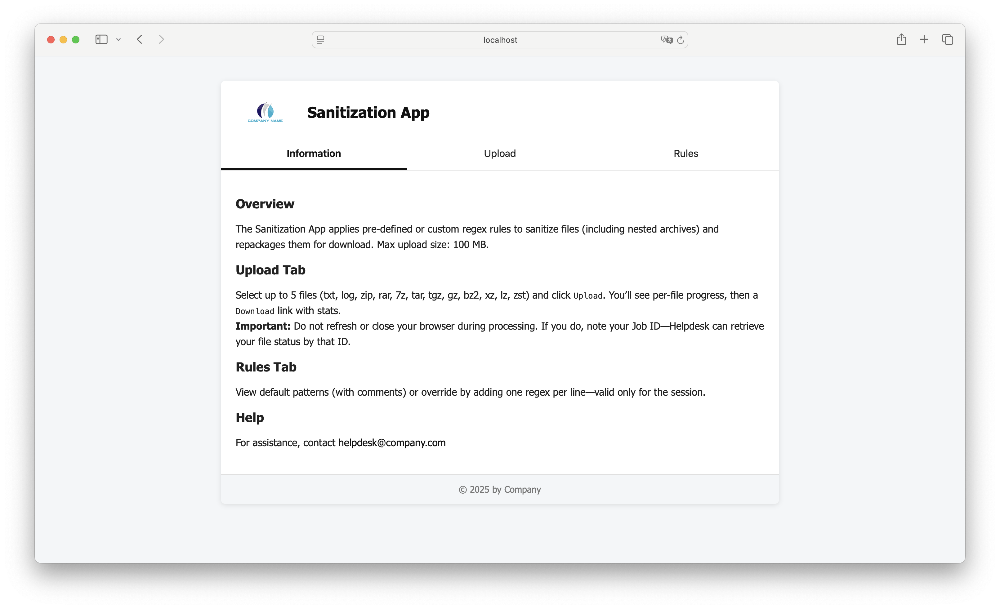
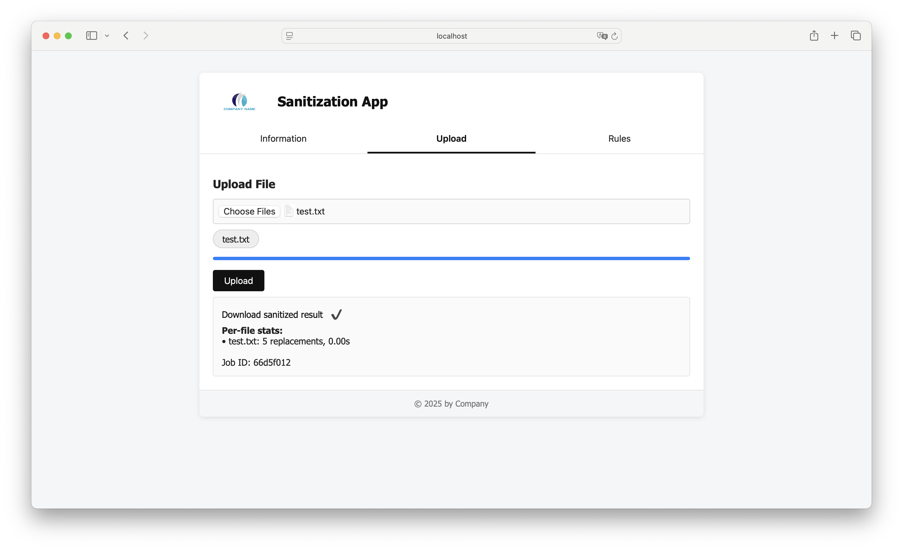
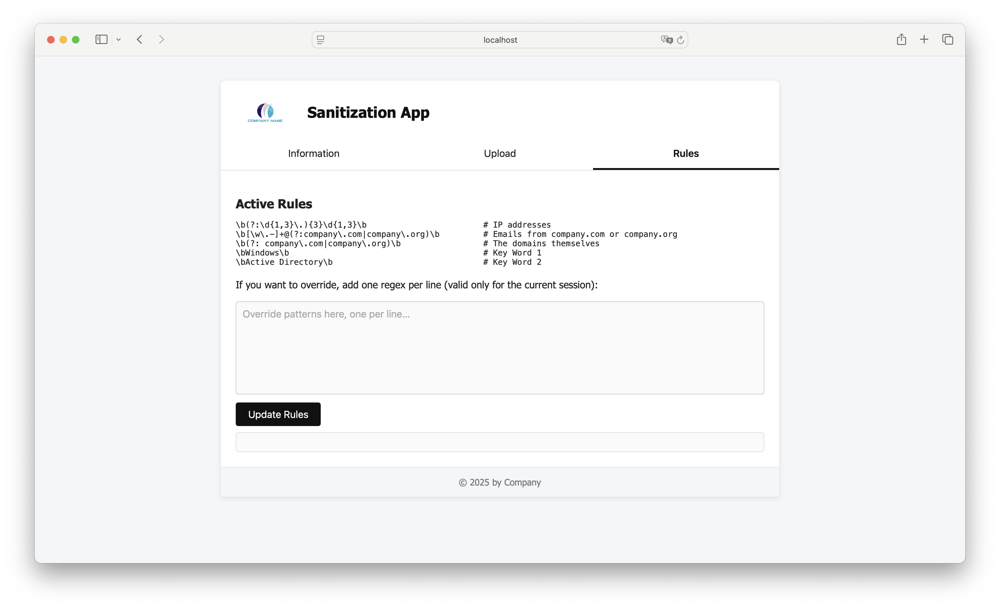

# 🧼 Sanitization App

A secure utility for sanitizing logs, text files, and archives using customizable regex rules.

Ideal for redacting secrets, PII, and sensitive data from support bundles, nested archives, and raw logs.

Built for internal use by small teams to automate text scrubbing and safe repackaging.

---

## ✨ Features

- ✅ Upload and sanitize `.txt`, `.log`, and various archive formats (`.zip`, `.7z`, `.tar`, `.gz`, `.bz2`, etc.)
- ✅ Recursively extracts and sanitizes nested archives
- ✅ Cleans invalid or non-ASCII filename characters (Windows-safe)
- ✅ Replaces sensitive content using pre-defined or custom **regex rules**
- ✅ Web UI lets users **override regex rules per session**
- ✅ Inline regex validation
- ✅ Secure download link using one-time token
- ✅ Download skipped if no replacements were made
- ✅ CLI mode
- ✅ Automatic cleanup
- ✅ Configurable: upload limits, thread count, regex caps, etc. — see [🔧 Configuration](#-configuration)

---

## 🚀 Quick Start

### Standalone Server (Dev Mode)

```bash
# Install dependencies
pip3 install flask cryptography

# On Debian/Ubuntu:
# 7z used only if built-in extraction fails or doesn’t support a format
sudo apt-get install p7zip-full

# Start the server with HTTPS (self-signed cert auto-generated if missing)
python3 sanitization_app.py --serve
```

Then open:
📎 https://<SERVER_IP>:8443

---

### CLI Mode

```bash
python3 sanitization_app.py path/to/file.txt
```

Optional:
```bash
# With inline regex patterns
python3 sanitization_app.py input.txt --rules "secret" "password"

# Or with a rules file
python3 sanitization_app.py input.txt --rules-file custom_rules.txt
```

---

## 🐳 Run via Docker

### Use Prebuilt Image (Remote)

```bash
# Pull the latest image from GitHub Container Registry
docker pull ghcr.io/rafee79/sanitization-app:latest

# Start the container using remote image
docker-compose -f docker-compose-remote.yml up -d
```

### Build Locally

```bash
# Build the image from source and start the container
docker-compose up --build -d
```

---

## 🔧 Configuration

All main settings are defined at the top of `sanitization_app.py`:

```python
MAX_UPLOAD_MB  = 100     # Max upload file size per request (in megabytes)
MAX_THREADS    = 15      # Max concurrent processing threads
MAX_RULES      = 20      # Max regex rules allowed per session
MAX_RULE_LEN   = 100     # Max length (chars) of a single regex pattern
MAX_FILES      = 5       # Max number of files per upload
PURGE_DAYS     = 1       # Auto-delete old files after N days
REPL_CHAR      = 'XXX'   # Replacement string for matches and invalid filename chars
```

### SSL Certificates

- On first run, default self-signed certificates are generated as:
  - `cert.pem`
  - `key.pem`
- Replace with your own cert/key in the project `certs` directory.

---

## ⚠️ Important Security Notice

> 🔒 **This tool is NOT safe for public internet exposure.**

- No authentication
- No CSRF/XSS protection
- Assumes trusted internal use
- Do **NOT** expose to the internet

For production deployments:
- Add user authentication (e.g., Flask-Login)
- Add rate-limiting & CSRF protection
- Serve behind a reverse proxy (e.g., NGINX + HTTPS)
- Harden MIME/file-type checking

---

## 🖼️ Screenshots

### 🧾 Web UI - Information


### 🧼 Web UI - Upload & Download


### ⚙️ Rules Tab - Custom Regex


---

## 📄 License

MIT License
